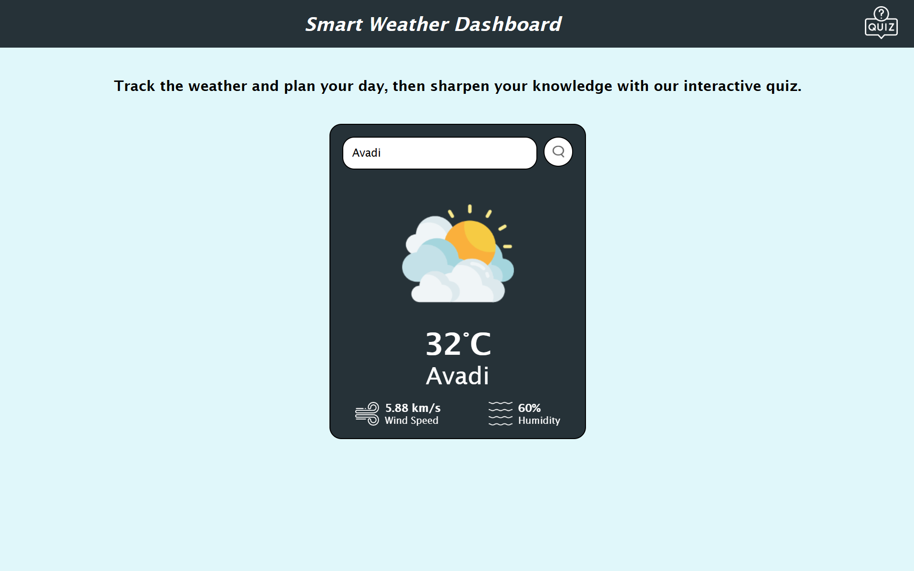

# 🌦️ Weather + Quiz App 🎯  



A unique web application that combines real-time weather information with a fun and interactive trivia quiz. Get weather updates for any city and challenge your brain with a quiz — all in one place!

## Table of Contents
- [Features](#features)
- [Installation](#installation)
- [Usage](#usage)
- [APIs Used](#apis-used)
- [Tech Stack](#tech-stack)
- [Project Structure](#project-structure)
- [Website Link](#website-link)

## Features

- 🌤️ **Weather Module**:
  - Search by city to view real-time weather data
  - Displays temperature, condition, humidity, wind speed
  - Dynamic background and icons based on weather

- 🧠 **Quiz Module**:
  - Random trivia questions from Open Trivia DB API
  - Multiple-choice format with shuffled options
  - Instant answer feedback and next question button

- 🧩 **Interactive UI**:
  - Smooth transitions between weather and quiz sections
  - Responsive layout for all devices


## Installation

1. Clone the repository:
   ```bash
   git clone https://github.com/yourusername/Weather-Quiz-Website.git
   ```

2. Navigate to the project directory:
   ```bash
   cd Weather-Quiz-Website
   ```

3. Open `index.html` in your browser.

## Usage

- Enter a city name to fetch and view weather information.
- Click **Start Quiz** to begin the trivia challenge.
- Choose an answer and get instant feedback.
- Click **Next** to continue with new questions.

## APIs Used

- 🌍 **OpenWeatherMap API** — for real-time weather data  
  [https://openweathermap.org/api](https://openweathermap.org/api)

- 📚 **Open Trivia DB API** — for quiz questions  
  [https://opentdb.com/api_config.php](https://opentdb.com/api_config.php)

## Tech Stack

- **HTML5**
- **CSS3** (Flexbox, Animations)
- **JavaScript (ES6)** — fetch API, DOM manipulation, dynamic rendering

## Project Structure
```bash
weather-quiz-app/
├── index.html
├── style.css
├── script.js
├── images/
│   └── weather-icons/
│   └── quiz-icons/
```

## Website Link

🔗 [Visit the App](https://your-weather-quiz.vercel.app/)
